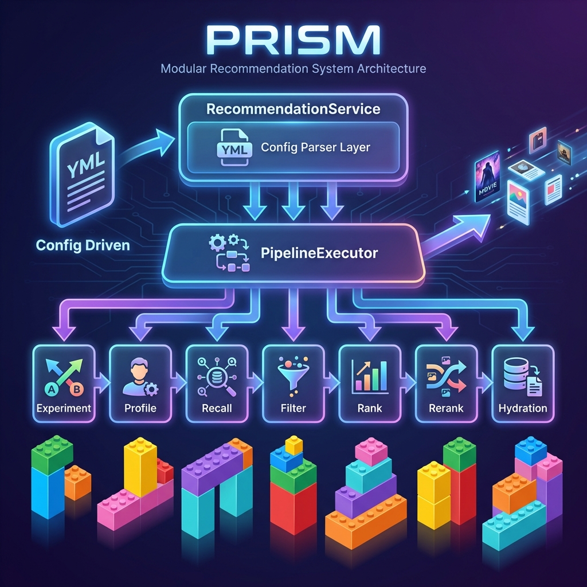

# 🔮 Prism

> 一个轻量级、可配置的推荐系统工程框架

[](https://openjdk.org/)
[](https://spring.io/projects/spring-boot)
[](LICENSE)



## 这是什么？

Prism 是一个**推荐系统的工程框架**，帮你把推荐流程标准化。

想象一下，你要做一个"猜你喜欢"功能：

1. 先从多个地方找候选内容（召回）
2. 过滤掉不合适的（过滤）
3. 按相关性排序（排序）
4. 最后展示给用户（填充详情）

Prism 把这些步骤**流水线化**，你只需要：

- 写好每个步骤的逻辑（Strategy）
- 配置好执行顺序（YAML）

剩下的事情框架帮你搞定。

## 🎯 适合谁用？

- 想快速搭建推荐系统原型的开发者
- 学习推荐系统架构的同学
- 需要 A/B 测试能力的团队

## 🚀 快速开始

```bash
git clone https://github.com/xi-mad/prism.git
cd prism
mvn spring-boot:run -Dspring-boot.run.jvmArguments="--enable-preview"
```

## 🌐 Web 演示

启动后访问 **http://localhost:9990/** 可体验完整功能：

- 📝 **YAML 配置编辑器** - 实时编辑完整配置
- 🎯 **可用策略列表** - 查看所有已注册策略
- 📊 **推荐结果展示** - 卡片式结果展示
- 🔍 **执行追踪** - Debug 模式下查看完整 Trace

## 📡 REST API

| 接口              | 方法 | 说明                         |
| ----------------- | ---- | ---------------------------- |
| `/api/recommend`  | POST | 使用自定义 YAML 配置获取推荐 |
| `/api/strategies` | GET  | 获取所有可用策略列表         |

## 📖 工作流程

```
用户请求 → 实验分流 → 画像加载 → 多路召回 → 过滤 → 排序 → 重排 → 填充 → 返回结果
```

每个阶段都可以：

- ✅ 配置多个策略并行执行
- ✅ 根据 A/B 实验走不同分支
- ✅ 通过 YAML 热配置

## ⚙️ 配置示例

```yaml
# 定义 A/B 实验
experiments:
  - id: "recall_test"
    variants: ["full", "lite"]

# 召回阶段：不同实验组用不同策略
recall:
  - when: { experiment: "recall_test", variant: "full" }
    steps:
      - name: "UserInterestRecall"
      - name: "VectorRecall"
  - when: { experiment: "recall_test", variant: "lite" }
    steps:
      - name: "UserInterestRecall"
```

## 🔧 技术栈

- **Java 25** - 使用虚拟线程实现高并发召回
- **Spring Boot 4** - 依赖注入、自动配置
- **策略模式** - 每个阶段可插拔

## 📁 项目结构

```
src/main/java/com/ximad/prism/
├── config/     # 配置模型
├── controller/ # REST API
├── core/       # 核心模型 (Context, Request, Item)
├── engine/     # 引擎 (Service, Executor)
├── plugin/     # 策略接口
├── service/    # 各阶段服务
└── strategy/   # 策略实现
```

## 🤝 贡献

欢迎提 Issue 和 PR！

## 📝 License

MIT
